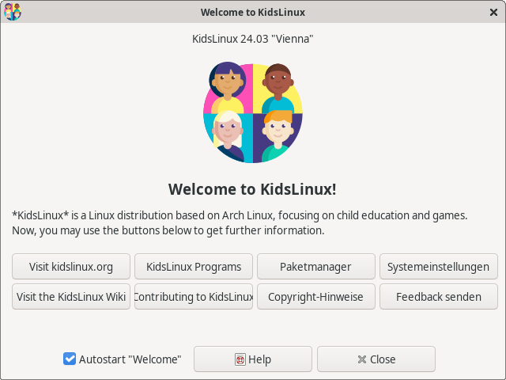
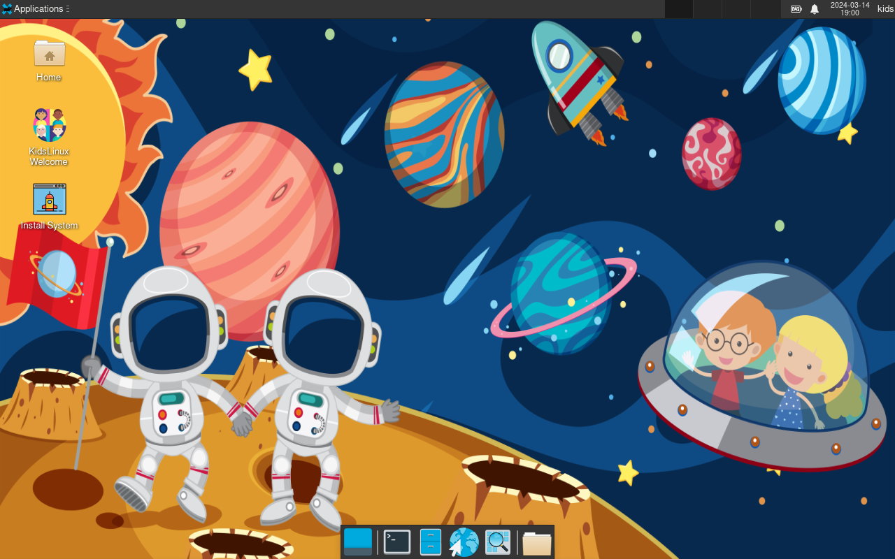

# KidsLinux

*__KidsLinux__* is a Linux distribution based on Arch Linux, focusing on child education and games.

#### Why should I use KidsLinux?

TODO

#### Verify signature

It is recommended to verify the image signature before use. On a system with GnuPG installed, do this by downloading the ISO PGP signature to the same directory than the ISO file, and verifying it with:

    $ gpg --verify  kidslinux-2024.03.01-x86_64.iso.asc

The ISO Size is mostly about 1.1 to 2.5 GB.

#### What programs are included?

On the installation image / after a disk install:

- SuperTux
- SuperTuxKart
- DOSBox
- ScummVM
    - Beneath a Steel Sky
    - Dráscula: The Vampire Strikes Back
    - Flight of the Amazon Queen TODO
    - Lure of the Temptress
- GCompris
- Stellarium

Optional games and programs the user might want to install can be found using "Add/Remove Software" or `pamac-manager`.

#### Screenshots

KidsLinux Welcome App

Astro Linux Desktop (using XFCE)

Astro Linux Installer (using Calamares) - TODO

#### Known issues

See [here](https://github.com/amstelchen/KidsLinux/issues)

#### Licenses

*__KidsLinux__* is licensed under the terms of the **GPL-3.0-or-later** (see [LICENSE](LICENSE)).  
<a href="https://www.flaticon.com/free-icons/people" title="people icons">People icons created by Freepik - Flaticon</a>
<a href="https://www.vecteezy.com/free-vector/background">Background Vectors by Vecteezy</a>
